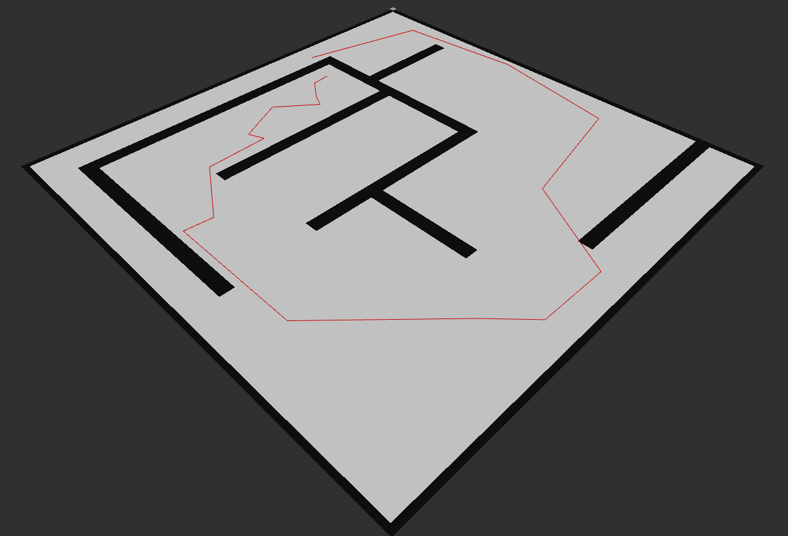

# ROS path planner

## Tools:
 - OMPL
 - costmap_2D
 - dynamic_reconfigure
 
## Usage
 1. Run:
 ```roslaunch /{your catkin workspace dir}/src/path_planner/run.launch```
 2. Add screen by topic **/map** (Rviz)
 3. Add screen by topic **/solver_path** (Rviz)
 4. Point start with *2D Pose Estimate* interface (Rviz)
 5. Point goal with *2D Nav Goal* interface (Rviz)
 
 To choose appropriate planner select it from options list in opened rqt_reconfigure window.
 ---
 

